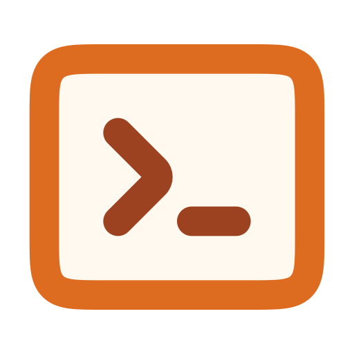

# :lucide-rocket: Get Started

[{ align=right width=96 }](https://github.com/cssnr/toml-run?tab=readme-ov-file#readme)

[](https://pypi.org/project/toml-run/)
[](https://github.com/cssnr/toml-run?tab=readme-ov-file#readme)
[](https://pypistats.org/packages/toml-run)
[](https://clickpy.clickhouse.com/dashboard/toml-run)
[](https://codecov.io/gh/cssnr/toml-run)
[](https://github.com/cssnr/toml-run/actions/workflows/test.yaml)
[](https://github.com/cssnr/toml-run/pulse)
[](https://github.com/cssnr/toml-run/issues)
[](https://github.com/cssnr/toml-run/discussions)
[](https://github.com/cssnr/toml-run/forks)
[](https://github.com/cssnr/toml-run/stargazers)
[](https://cssnr.github.io/)
[](https://discord.gg/wXy6m2X8wY)
[](https://ko-fi.com/cssnr)

Define custom scripts in your pyproject.toml and easily run them with this dependency free tool.
This tool is both inspired by and similar to [NPM Scripts :lucide-arrow-up-right:](https://docs.npmjs.com/cli/v8/using-npm/scripts).

To get started see the [Quick Start](#quick-start) section or check out the [Features](#features).

=== "uv"

    ```shell
    uv tool install toml-run
    ```

=== "uv + dev"

    ```shell
    uv add --dev toml-run
    ```

=== "pip"

    ```shell
    pip install toml-run
    ```

=== "pip + dev"

    ```shell
    pip install --group dev toml-run
    ```

=== "brew"

    ```shell
    brew tap cssnr/tap
    brew install toml-run
    ```

```toml title="pyproject.toml"
[tool.scripts]
build = "uv run hatch build"
```

```shell
run build
```

!!! tip "There are detailed [Install](reference.md#install), [Script](reference.md#scripts) and [Usage](reference.md#usage) guides available."

If you run into any issues or have any questions, [support](support.md) is available.

## :lucide-sparkles: Features

- Define scripts in your `pyproject.toml`
- Easily run scripts with `run [name]`
- Cross-platform support using subprocess
- Supports `pre` and `post` scripts
- Supports multiple commands per script
- Pass additional arguments to scripts
- Automatically finds the `pyproject.toml`
- Runs scripts relative to the root directory
- Evaluate python code :lucide-flask-conical:{ title="Experimental Feature!" }

For more details see the [full reference](reference.md).

## :lucide-plane-takeoff: Quick Start

First, [install](reference.md#install) the package from [PyPi :lucide-arrow-up-right:](https://pypi.org/p/toml-run)
or [GitHub :lucide-arrow-up-right:](https://github.com/cssnr/toml-run?tab=readme-ov-file#readme).

=== "uv"

    ```shell
    uv tool install toml-run
    ```

=== "uv + dev"

    ```shell
    uv add --dev toml-run
    ```

=== "pip"

    ```shell
    pip install toml-run
    ```

=== "pip + dev"

    ```shell
    pip install --group dev toml-run
    ```

=== "brew"

    ```shell
    brew tap cssnr/tap
    brew install toml-run
    ```

Then, add some [scripts](reference.md#scripts) to the `pyproject.toml`.

```toml title="pyproject.toml"
[tool.scripts]
clean = "rm -rf dist"
build = "run clean && uv run hatch build"
prelint = "echo always runs before lint"
lint = ["uv run ruff check .", "uv run ty check ."]
postlint = "echo always runs after lint"
```

Finally, [run](reference.md#usage) a script.

```shell
run build
```

Or, run without installing using [astral-sh/uv :lucide-arrow-up-right:](https://docs.astral.sh/uv/).

```shell
uvx toml-run build
```

[:simple-toml: Script Reference](reference.md#scripts){ .md-button .md-button--primary }

[:lucide-square-terminal: Usage Reference](reference.md#usage){ .md-button .md-button--primary }

&nbsp;

!!! question

    If you need **help** getting started or run into any issues, [support](support.md) is available!
